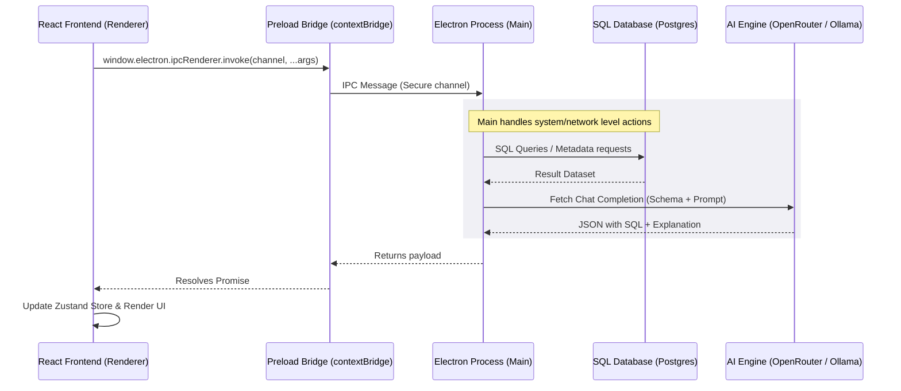

# SpeakDB Architecture & Technical Explanation

This document provides an in-depth breakdown of **SpeakDB**, a privacy-first, open-source desktop application that lets users interact with SQL databases using natural language. It functions similarly to Cursor but is designed specifically for SQL databases.

Below, you will find a complete walkthrough of the architecture, the application startup lifecycle, and detailed user workflows mapping each action to its corresponding TypeScript files.

---

## 🏛️ High-Level Architecture

SpeakDB is built as an **Electron** desktop application. Electron splits the application into two main processes that communicate asynchronously:

1. **Main Process (Node.js Environment)**:
   - Handles direct system operations: database connections, network requests, environment variables, and system events.
   - Files reside in `src/main/`.
2. **Renderer Process (Chromium/Browser Environment)**:
   - Runs the React + TypeScript frontend, user interface components, and client-side stores.
   - Files reside in `src/renderer/`.
3. **Preload Script (Bridge)**:
   - Safely exposes APIs (like IPC handlers) from the Main process to the Renderer process using Electron's `contextBridge`.
   - File: `src/preload/index.ts`.

Here is a visual flowchart mapping the end-to-end communication cycle:



---

## 🚀 Startup Lifecycle: From `npm run dev` to UI Render

When you start the application, the execution flow follows a precise path to launch both the frontend and backend layers:

### 1. Build and Hot Module Replacement (HMR)
- **Files involved**: [package.json](file:///E:/github/SpeakDB/package.json) ➔ [electron.vite.config.ts](file:///E:/github/SpeakDB/electron.vite.config.ts)
- Running `npm run dev` triggers `electron-vite dev`. This launches two development builds:
  - Vite bundles the React frontend (`src/renderer/src/main.tsx`).
  - Electron-Vite compiles the Node.js main process code (`src/main/index.ts`).

### 2. Main Process Bootstrapping
- **File involved**: [src/main/index.ts](file:///E:/github/SpeakDB/src/main/index.ts)
- `dotenv.config()` loads environment variables from the `.env` file (e.g., API keys).
- `app.whenReady()` triggers initialization:
  - Registers all Inter-Process Communication handlers via `registerIPCHandlers()`.
  - Creates the Chromium window via `createWindow()`.
  - In development, it loads the URL specified by `process.env.ELECTRON_RENDERER_URL` (usually `http://localhost:5173`). In production, it loads the compiled `renderer/index.html` file.

### 3. Preload Script Execution
- **File involved**: [src/preload/index.ts](file:///E:/github/SpeakDB/src/preload/index.ts)
- Loaded inside the Chromium web preferences configuration.
- Uses `contextBridge.exposeInMainWorld` to attach the `electron` API containing `ipcRenderer` to the browser's global `window` object. This allows the React app to communicate with Node.js securely without exposing full node capabilities directly to the window.

### 4. IPC Registry Initialization
- **File involved**: [src/main/ipc/index.ts](file:///E:/github/SpeakDB/src/main/ipc/index.ts)
- Binds listener channels to handle database queries and AI prompts:
  - `db:connect`, `db:disconnect`, `db:execute-query`, `db:get-schema`, `db:test-connection`
  - `ai:generate-sql`, `ai:explain-sql`, `ai:optimize-sql`, `ai:chat`, `ai:interpret-results`

### 5. Frontend Mount and Auto-Connection
- **Files involved**: [src/renderer/src/main.tsx](file:///E:/github/SpeakDB/src/renderer/src/main.tsx) ➔ [src/renderer/src/App.tsx](file:///E:/github/SpeakDB/src/renderer/src/App.tsx) ➔ [src/renderer/src/components/layout/AppLayout.tsx](file:///E:/github/SpeakDB/src/renderer/src/components/layout/AppLayout.tsx)
- React app is rendered inside the root element. It instantiates the TanStack Query client, wraps the router ([src/renderer/src/router/index.tsx](file:///E:/github/SpeakDB/src/renderer/src/router/index.tsx)), and loads the main shell layout `AppLayout`.
- `AppLayout` contains a `useEffect` hook that checks for a cached database connection in the Zustand `connectionStore`. If found, it automatically invokes `window.electron.ipcRenderer.invoke('db:connect', activeConnection)` to restore the database session on launch.

---

## 🔄 Detailed User Workflows

Here is a step-by-step breakdown of how user interactions flow through the application files.

### Workflow A: Adding and Connecting to a Database
When a user adds database connection credentials and clicks "Connect":

1. **User Action**: The user inputs credentials (host, port, database, username, password) and clicks "Save" / "Connect".
   - **File**: [src/renderer/src/pages/Connections/index.tsx](file:///E:/github/SpeakDB/src/renderer/src/pages/Connections/index.tsx)
2. **State Management**: The UI updates the Zustand connection store.
   - **File**: [src/renderer/src/store/connectionStore.ts](file:///E:/github/SpeakDB/src/renderer/src/store/connectionStore.ts)
     - Calls `addConnection` to save the configuration persistently using Zustand's `persist` middleware (written to standard Web Storage).
     - Sets connection status to `'connecting'`.
3. **IPC Bridge**: The frontend invokes the bridge connection handler.
   - **File**: [src/renderer/src/pages/Connections/index.tsx](file:///E:/github/SpeakDB/src/renderer/src/pages/Connections/index.tsx) (inside `handleConnect()`)
     - Code: `await window.electron.ipcRenderer.invoke('db:connect', conn)`
4. **Node Backend**: The Main process captures this message in [src/main/ipc/index.ts](file:///E:/github/SpeakDB/src/main/ipc/index.ts) and calls the database manager.
   - **File**: [src/main/database/dbManager.ts](file:///E:/github/SpeakDB/src/main/database/dbManager.ts)
     - Inside `DatabaseManager.connect(config)`:
       ```typescript
       this.client = new Client({
         host: config.host || 'localhost',
         port: config.port || 5432,
         database: config.database,
         user: config.username,
         password: config.password,
         ssl: config.ssl ? { rejectUnauthorized: false } : undefined
       })
       await this.client.connect()
       this.activeConnection = this.client
       ```
     - On successful connection, it returns `true` to the renderer, updating the Zustand state to `'connected'`.

---

### Workflow B: Automatically Fetching and Compressing the Schema
To translate natural language to SQL, the AI needs to understand the database tables and columns without overloading context window token limits.

1. **Trigger**: When a user submits a chat message, the frontend requests the database schema.
   - **File**: [src/renderer/src/pages/Chat/index.tsx](file:///E:/github/SpeakDB/src/renderer/src/pages/Chat/index.tsx)
     - Code: `schemaContext = await window.electron.ipcRenderer.invoke('db:get-schema')`
2. **Catalog Fetching**:
   - **File**: [src/main/database/dbManager.ts](file:///E:/github/SpeakDB/src/main/database/dbManager.ts)
     - Inside `DatabaseManager.getSchema()`:
       - Executes metadata SQL queries against PostgreSQL `information_schema.columns` to fetch column names and data types.
       - Querying `information_schema.table_constraints` maps primary keys (`PK`) and foreign keys (`FK` references).
       - Queries `pg_class` to obtain estimated row counts (`reltuples::bigint`) for each table to optimize catalog indexing speed.
3. **Smart Schema Compression**:
   - **File**: [src/main/ai/aiManager.ts](file:///E:/github/SpeakDB/src/main/ai/aiManager.ts)
     - Inside `compressSchema(schema)`:
       - Compresses the schema by **70% to 80%** before transmission to the AI.
       - Replaces long type names with short abbreviations (e.g. `character varying` ➔ `varchar`, `integer` ➔ `int`, `decimal` ➔ `dec`).
       - Condenses table representations into compact strings:
         `users(id int pk, name varchar, email varchar, status varchar); orders(id int pk, user_id int fk->users.id, total_amount dec)`

---

### Workflow C: Submitting a Chat Prompt and Generating SQL
When a user types *"show me all users who registered last week"* and presses Send:

1. **Frontend Dispatch**:
   - **File**: [src/renderer/src/pages/Chat/index.tsx](file:///E:/github/SpeakDB/src/renderer/src/pages/Chat/index.tsx) (inside `handleSend()`)
     - Adds user message to the thread in [src/renderer/src/store/chatStore.ts](file:///E:/github/SpeakDB/src/renderer/src/store/chatStore.ts).
     - Pulls active AI configurations (provider, API keys, models) from [src/renderer/src/store/settingsStore.ts](file:///E:/github/SpeakDB/src/renderer/src/store/settingsStore.ts).
     - Gathers conversational history (up to 5 recent turns) to enable multi-turn context tracking.
     - Invokes:
       ```typescript
       const aiResponse = await window.electron.ipcRenderer.invoke(
         'ai:generate-sql',
         userPrompt,
         schemaContext,
         aiConfig,
         turns
       )
       ```
2. **Fast-Path Pre-Filtering (Guardrails)**:
   - **File**: [src/main/ai/aiManager.ts](file:///E:/github/SpeakDB/src/main/ai/aiManager.ts)
     - Inside `classifyLocally(prompt)`:
       - Run local regex checks to instantly intercept greetings, identity queries, or common prompt-injection commands (e.g., *"ignore previous instructions"*).
       - Intercepted prompts return immediately with fixed static responses (e.g. `OUT_OF_SCOPE_MESSAGE`) without making a API call, saving API costs.
3. **API Query Execution**:
   - **File**: [src/main/ai/aiManager.ts](file:///E:/github/SpeakDB/src/main/ai/aiManager.ts)
     - Constructs a hardened system prompt enforcing that the AI acts as a SQL translator named "Parser", stays strictly within the provided database schema, and outputs only structured JSON:
       ```json
       {
         "sql": "SELECT * FROM \"users\" WHERE registered_at >= NOW() - INTERVAL '7 days';",
         "explanation": "Selects all columns from users table where registration is within the last 7 days."
       }
       ```
     - Hits the model completion API endpoint (OpenRouter or Ollama local endpoints).
4. **Validation and UI Update**:
   - **File**: [src/main/ai/aiManager.ts](file:///E:/github/SpeakDB/src/main/ai/aiManager.ts)
     - Inside `parseSqlResponse(content)`:
       - Validates that the returned SQL is syntactically sound and contains basic SQL keywords (using `looksLikeSQL` regex validation).
       - If invalid, the application falls back safely or refuses execution to prevent security exploits.
     - Displays the generated SQL and text explanation inside the chat feed page using the React state.

---

### Workflow D: Running SQL Queries (Safe-Mode Guardrails)
When a user clicks **"Execute Query"** in the chat feed to execute the SQL:

1. **Destructive Guardrails Check**:
   - **File**: [src/renderer/src/pages/Chat/index.tsx](file:///E:/github/SpeakDB/src/renderer/src/pages/Chat/index.tsx)
     - Inside `isDestructiveQuery(sql)`:
       - Inspects if the SQL text contains commands like `DROP`, `DELETE`, or `TRUNCATE`.
       - If a destructive command is detected, it intercepts execution and displays a modal requiring the user to explicitly click **"Execute Anyway"**.
2. **Backend Query Execution**:
   - **File**: [src/main/database/dbManager.ts](file:///E:/github/SpeakDB/src/main/database/dbManager.ts)
     - Inside `DatabaseManager.executeQuery(sql, maxRows)`:
       - Executes the SQL directly against the connected client session: `this.client.query(sql)`.
       - Measures execution latency (`executionTimeMs`).
       - Slices row outputs to respect the user's `maxRows` threshold (preventing crashes from massive datasets).
       - Returns a `QueryResult` schema: `{ columns, rows, executionTimeMs, affectedRows }`.

---

### Workflow E: Interpreting Query Results in Plain English
After the database responds, SpeakDB feeds the result back to the AI so it can summarize it.

1. **Frontend Call**:
   - **File**: [src/renderer/src/pages/Chat/index.tsx](file:///E:/github/SpeakDB/src/renderer/src/pages/Chat/index.tsx)
     - Triggered automatically after a query runs.
     - Invokes `window.electron.ipcRenderer.invoke('ai:interpret-results', ...)`
2. **Payload Compressing & Prompt Assembly**:
   - **File**: [src/main/ai/aiManager.ts](file:///E:/github/SpeakDB/src/main/ai/aiManager.ts)
     - Inside `DatabaseManager.interpretResults()`:
       - Serializes the first 25 database records into a clean, space-saving pipe-separated text table:
         ```text
         id|name|status
         1|Alice|Active
         2|Bob|Inactive
         ```
       - Constructs a summary prompt linking:
         - The original user question.
         - The executed SQL query.
         - The pipe-separated query result data.
       - Sends the query to the LLM to get a plain-English explanation (e.g., *"There are 2 users, but only Alice is currently active."*).
3. **Render**:
   - Displays the result summary inside the orange AI Explanation card in the chat window.

---

## 📂 Source Code Directory Map

```text
SpeakDB/
├── resources/                # App icons and build assets
├── src/
│   ├── main/                 # Node.js Electron Main Process
│   │   ├── ai/
│   │   │   └── aiManager.ts  # Handles LLM prompts, guardrails, schema compression
│   │   ├── database/
│   │   │   └── dbManager.ts  # Core client connection state & raw SQL executions
│   │   ├── ipc/
│   │   │   └── index.ts      # Exposes main process functions to IPC handles
│   │   └── index.ts          # Electron window bootstrap, loads env & registers IPCs
│   ├── preload/              # Electron Preload Bridge
│   │   ├── index.d.ts        # Global Window types declaration
│   │   └── index.ts          # Exposes secure context window.electron bridge APIs
│   └── renderer/             # React + Tailwind Frontend (Renderer)
│       └── src/
│           ├── assets/       # CSS stylesheet definitions (index.css)
│           ├── components/   # Shared UI components (layout wrappers)
│           ├── pages/        # Core page views (Chat, Connections, Schema, History)
│           │   ├── Chat/
│           │   │   └── index.tsx # Chat interface, safe-mode guardrails, executions
│           │   └── Connections/
│           │       └── index.tsx # DB credential configuration forms & connection status
│           ├── router/
│           │   └── index.tsx # React Router paths configurations
│           ├── store/        # Zustand clients state management
│           │   ├── chatStore.ts
│           │   ├── connectionStore.ts
│           │   └── settingsStore.ts
│           └── App.tsx       # Entry React app module setup
```
